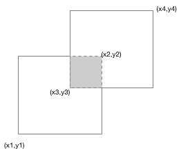

# Rectangles (introduction to objects)

This starter project is intended to be something you can complete in an hour or less
following tactics we work out in the first day lecture.  It illustrates some basic
concepts of object-oriented programming:  Class definitions, creating objects in a class, and defining methods shared by all objects of a class.

## Required behavior

The rectangles program computes the intersection (overlapping area) of two rectangles.

The first rectangle has lower left corner (x1,y1) and upper right corner (x2,y2).
The second rectangle has lower left corner (x3,y3) and upper right corner (x4,y4).  You may assume that x1 < x2, y1 < y2, x3 < x4, y3 < y4  (both rectangles have positive area).  The rectangles overlap if x3 < x2 < x4 and y3 < y2 < y4.  



 If the rectangles overlap, the output of the program will be the corners of their region of overlap, x3 y3 x2 y2.  If the rectangles do not overlap, the output will be the special empty rectangle 0 0 0 0.

The program runs from the command line, like this:

```
> python3 draw_rects.py 200 200 300 300   250 250 500 500 
Intersection: Rect(Point(250,250),Point(300,300))
> python3 draw_rects.py 200 200 300 300 200 300 500 500 
Intersection: Rect((0, 0),(0, 0))
```

A window will pop up, displaying the input rectangles (interpreting
the dimensions in screen pixels).. Click it to compute the intersection,
and then click again to finish and dismiss the canvas. 
